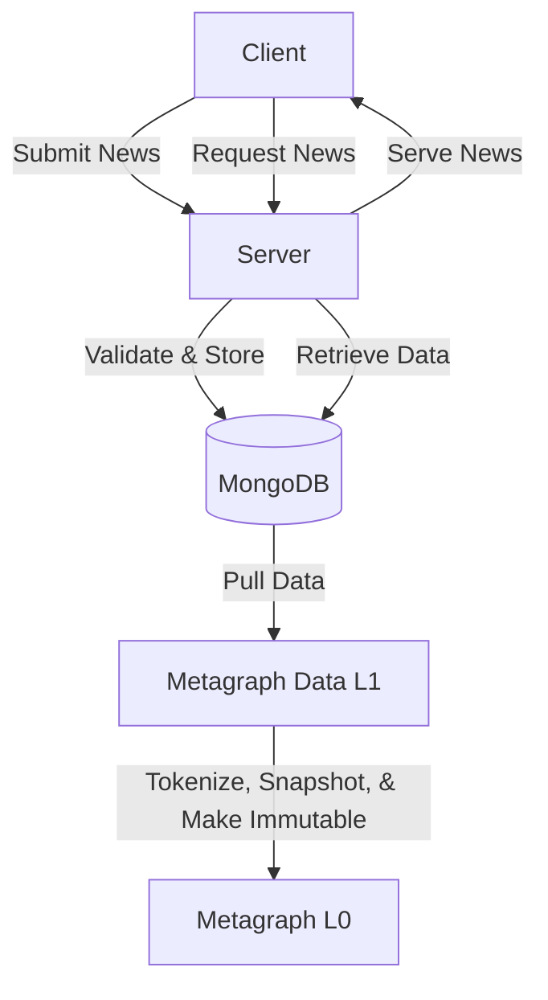
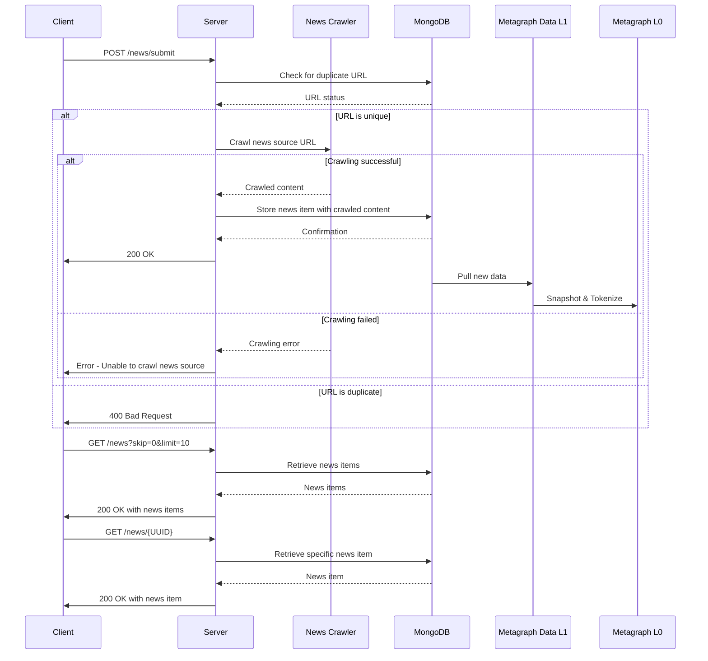

# Immutable News API

This API provides functionality to ingest news articles and initiate a crawling workflow.

## General Data Flow Diagram

## News Specific Data Flow Diagram


## Setup Instructions

### Project Setup
*Ensure you have a MongoDB instance running*
1. Clone the repository:
   ```
   git clone https://github.com/your-repo/immutable-news-api.git
   cd immutable-news-api
   cp .env.example .env
   # Modify .env with your MongoDB URI and database name
   ```

2. Create a virtual environment and activate it:
   ```
   python -m venv venv
   source venv/bin/activate  # On Windows, use `venv\Scripts\activate`
   ```

3. Install the required packages:
   ```
   pip install -r requirements.txt
   ```

4. Run the FastAPI application:
   ```
   fastapi dev server.py
   ```

   The API will be available at `http://localhost:8000`.

## Docker Setup
*The lxml dependency requires system dependencies to be installed. Additional setup may be required on some systems.*
1. Build the Docker image:
   ```
   docker build -t immutable-news-api .
   ```

2. Run the Docker container:
   ```
   docker run -p 8000:8000 immutable-news-api
   ```

Note: The Dockerfile has been updated to install necessary system dependencies for lxml.

## API Documentation

### POST /news/submit

Ingests a news article from a given URL and starts a crawling workflow.

#### Request

- URL: http://localhost:8000/news/submit
- Method: POST
- Content-Type: application/json
- Payload:
```json
{
   "url": "https://examplenews.com/year/month/day/news-name-blahblah,
   "dag_address": "DAG38E4KCMhidUv8SvovzuJXKsZZ9Ldn58xA6rYz"
}
```

#### Response

- Status: 200 OK
- Content-Type: application/json
```json
{
"message": "News article successfully crawled and stored"
}
```

### GET /news?skip=0&limit=10

Retrieves a list of news articles.

#### Request

- Method: GET

## Testing

1. Run the test script:
   ```
   python api/test_crawl_news.py
   ```

2. Use the provided shell script to test the API endpoint:
   ```
   chmod +x api/test-news.sh
   ./api/test-news.sh
   ```

## Project Structure

- `app/`
  - `main.py`: Main FastAPI application entry point
  - `api/`
    - `routes/`
      - `news.py`: News-related API routes
    - `helpers/`
      - `news_crawler.py`: News crawling service
  - `db/`
    - `config.py`: Database connection and configuration
   - `models/`
      - `news.py`: Pydantic models for news data
  - `config.py`: Application configuration
- `tests/`
  - `test_news_api.py`: API tests for news endpoints
  - `test_news_crawler.py`: Unit tests for news crawler
- `requirements.txt`: List of Python dependencies
- `Dockerfile`: Docker configuration for the application
- `README.md`: Project documentation (this file)
- `.env.example`: Example environment variables file
- `.gitignore`: Git ignore file

## Contributing

Please read [CONTRIBUTING.md](CONTRIBUTING.md) for details on our code of conduct and the process for submitting pull requests.

## License

This project is licensed under the MIT License - see the [LICENSE.md](LICENSE.md) file for details.