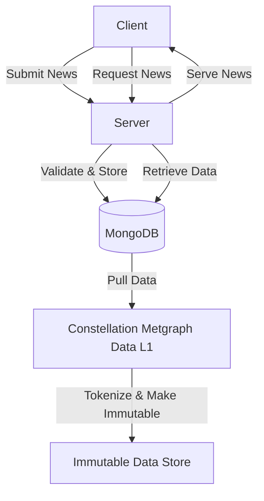

# Immutable News API

This API provides functionality to ingest news articles and initiate a crawling workflow.

## General Data Flow Diagram

## News Specific Data Flow Diagram


## Setup Instructions

### Project Setup

1. Clone the repository:
   ```
   git clone https://github.com/your-repo/immutable-news-api.git
   cd immutable-news-api
   ```

2. Create a virtual environment and activate it:
   ```
   python -m venv venv
   source venv/bin/activate  # On Windows, use `venv\Scripts\activate`
   ```

3. Install the required packages:
   ```
   pip install -r requirements.txt
   ```

4. Run the FastAPI application:
   ```
   uvicorn api.api:app --reload
   ```

   The API will be available at `http://localhost:8000`.

## Docker Setup

1. Ensure your `requirements.txt` file includes `lxml[html_clean]`:
   ```
   fastapi
   uvicorn
   newspaper3k
   pydantic
   lxml[html_clean]
   ```

2. Build the Docker image:
   ```
   docker build -t immutable-news-api .
   ```

3. Run the Docker container:
   ```
   docker run -p 8000:8000 immutable-news-api
   ```

Note: The Dockerfile has been updated to install necessary system dependencies for lxml.

## API Documentation

### POST /news/submit

Ingests a news article from a given URL and starts a crawling workflow.

#### Request

- Method: POST
- Content-Type: application/json
```json
{
"url": "https://example.com/news-article"
}```

#### Response

- Status: 200 OK
- Content-Type: application/json
```json
{
"message": "News article successfully crawled and stored"
}```
## Testing

1. Run the test script:
   ```
   python api/test_crawl_news.py
   ```

2. Use the provided shell script to test the API endpoint:
   ```
   chmod +x api/test-news.sh
   ./api/test-news.sh
   ```

## Project Structure

- `api/`
  - `api.py`: Main FastAPI application
  - `test_crawl_news.py`: Test script for the crawl_news function
  - `test-news.sh`: Shell script to test the API endpoint
- `requirements.txt`: List of Python dependencies
- `Dockerfile`: Docker configuration for the application
- `README.md`: This file

## Contributing

Please read [CONTRIBUTING.md](CONTRIBUTING.md) for details on our code of conduct and the process for submitting pull requests.

## License

This project is licensed under the MIT License - see the [LICENSE.md](LICENSE.md) file for details.